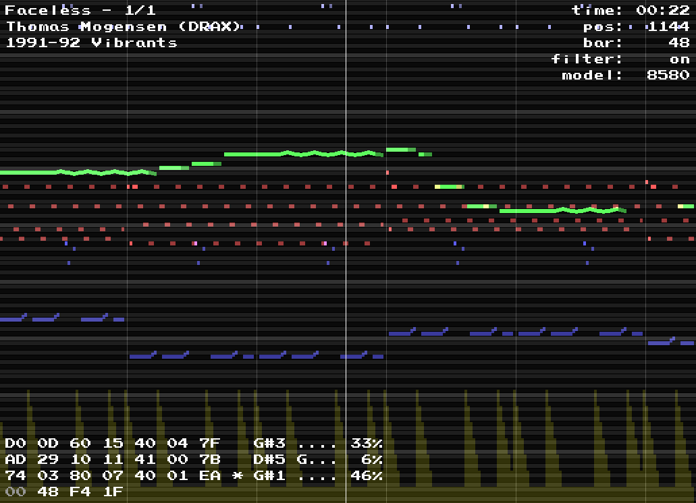

SID Monitor
===========

A SID player with piano-roll-like visualization.
If you like it, you may also like [NSF monitor](https://github.com/2bt/nsf-monitor).

Each channel is shown in a certain color:
<table>
    <tr><td>Channel 1</td><td>red</td></tr>
    <tr><td>Channel 2</td><td>green</td></tr>
    <tr><td>Channel 3</td><td>blue</td></tr>
</table>

## Controls

<table>
    <tr>
        <td><code>SPACE</code></td>
        <td>Toggle playback.</td>
    </tr>
    <tr>
        <td><code>1</code>/<code>2</code>/<code>3</code></td>
        <td>Toggle channels.</td>
    </tr>
    <tr>
        <td><code>LEFT</code>/<code>RIGHT</code></td>
        <td>
            Move through the song. 
            Hold <code>SHIFT</code> to move faster. 
            Hold <code>CTRL</code> to move frame by frame.
        </td>
    </tr>
    <tr>
        <td><code>UP</code>/<code>DOWN</code></td>
        <td>
            Scroll up/down.
        </td>
    </tr>
    <tr>
        <td><code>BACKSPACE</code></td>
        <td>Jump to the beginning of the song.</td>
    </tr>
    <tr>
        <td><code>+</code>/<code>-</code></td>
        <td>Time zoom.</td>
    </tr>
    <tr>
        <td><code>PAGE DOWN</code>/<code>PAGE UP</code></td>
        <td>Pitch zoom.</td>
    </tr>
    <tr>
        <td><code>TAB</code></td>
        <td>Toggle SID engine.</td>
    </tr>
    <tr>
        <td><code>B</code></td>
        <td>Toggle bars.</td>
    </tr>
    <tr>
        <td><code>F</code></td>
        <td>Toggle filter.</td>
    </tr>
    <tr>
        <td><code>M</code></td>
        <td>Toggle chip model.</td>
    </tr>
    <tr>
        <td><code>W</code>/<code>S</code>/<code>A</code>/<code>D</code></td>
        <td>Change bar offset/width.</td>
    </tr>
    <tr>
        <td><code>&lt;</code>/<code>&gt;</code></td>
        <td>Switch sub tune.</td>
    </tr>
</table>
